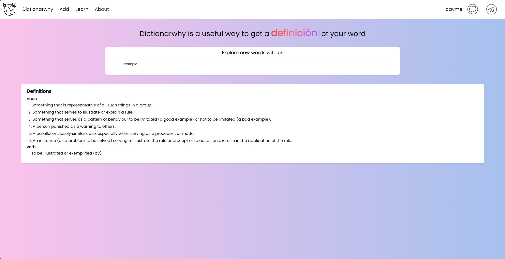

# Dictionarwhy - это словарь и место для повторения слов.

Первоначально английских слов реализованный через REST API. Затем идея расширилась до приложения изучания и повторения слов.
В этом проекте я начал изучать новые для себя React и Tailwind, на бекенде попробовал Bun и ElysiaJs. Так же sqlite для базы данных.
Прошел все стадии деплоя в облачную инфраструктур, нуастроил домен и ssl сертификат. Бек упакован в докер, фронт пока нет (но может потом сделаю).

[Доступно по ссылке](https://www.dictionarwhy.fun)
